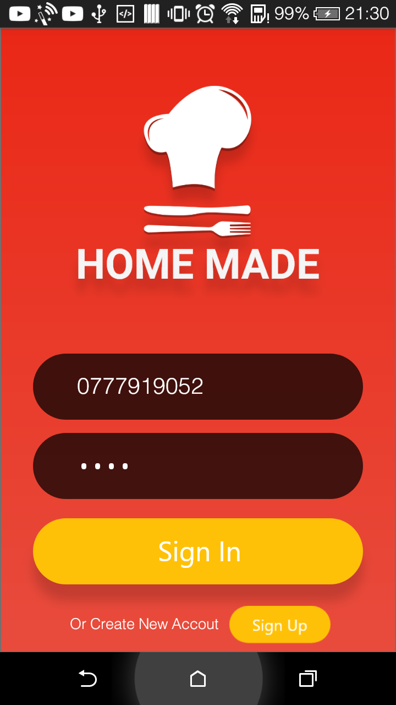
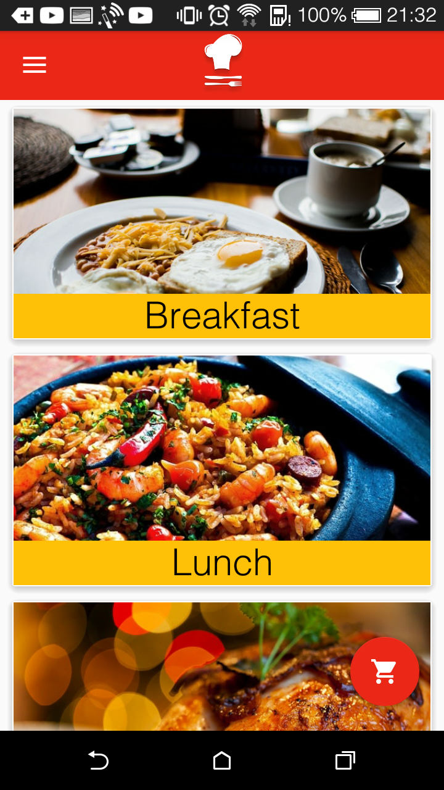
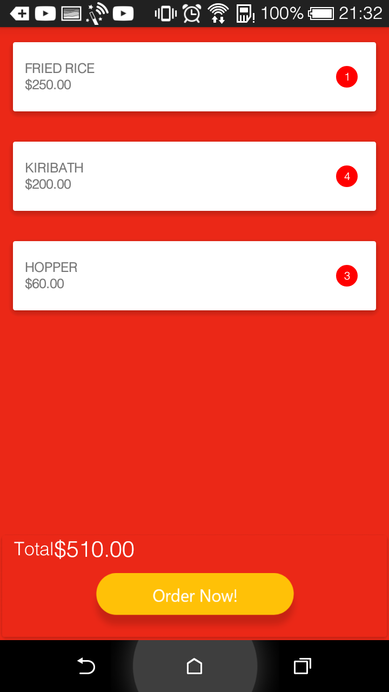
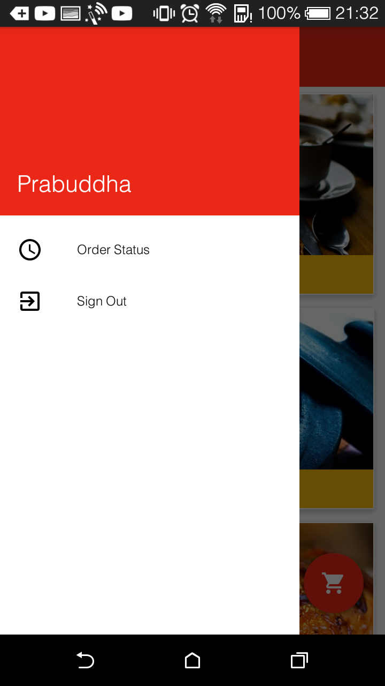

# food-ordering-app
Client side food ordering android app

# Home Made App

**Technology used in the app**

- Real Time Firebase database to store users, food items and requests.
- Firebase storage to store all the pictures of foods.
- SQLite database to store cart food item.
- Adobe XD to design the app.

Sign Up from here

There are 6 categories of foods. You can choose any category and order as many as you want.

   

Order from here.
Enter quantity from here. Only 20 pcs at once.

Also you can order multiple food items.
Press Cart button to view the cart

In the cart you can see all the food item you’ve ordered with the total price. Press “Order Now”
To order food items.

Then you can see the Order request has been made for the this order in order status in “Order
Status” as below.

   
