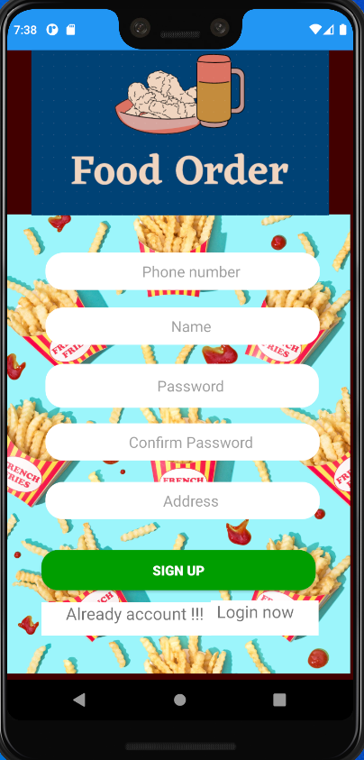
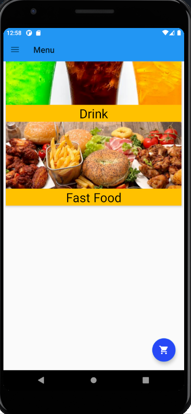
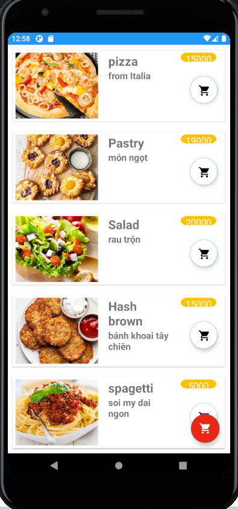
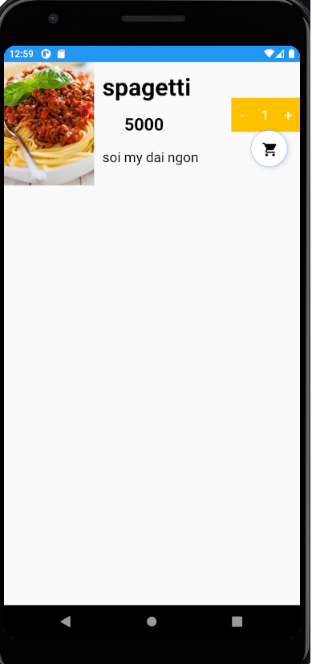
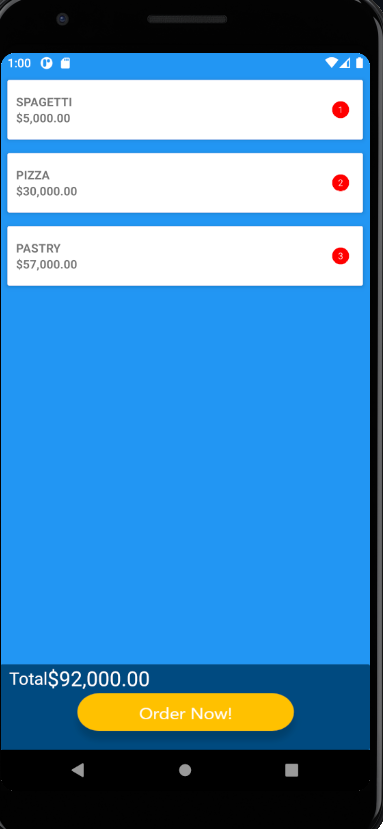
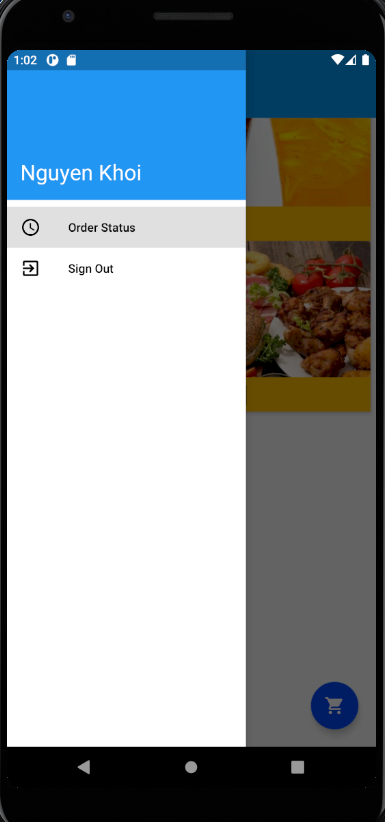
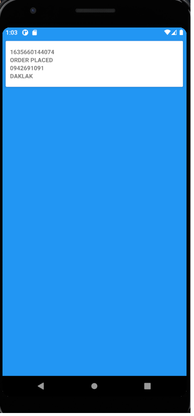

# FoodTNK
1 Ứng dụng android giúp bạn đặt món ăn

# FoodTNK App

**Công nghệ được sử dụng trong app**

- Real Time Firebase database để lưu trữ user, đồ ăn và đơn khách đã mua.
- SQLite database để lưu trữ giỏ hàng của người dùng.

Màn hình đăng kí tài khoản mới:

Ở đây có nhiều sự lựa chọn đồ ăn. Bạn có thể chọn dồ ăn bạn muốn và bỏ vừa giỏ hàng.

   

Đặt hàng ở đây. 
Chọn số lượng bạn muốn mua

Bạn cũng có thể mua nhiều món khác nhau
Bấm vào nút cart để xem giỏ hàng của bạn

Trong cart bạn có thể xem được những món bạn sẽ mua và tổng cộng tiền phải trả là bao nhiêu. bấm “Order Now”
để tiến hành đặt hàng.

Sau đó bạn có thể xem lại lịch sử bạn đã mua hàng như thế nào.

   

Trong tương lai tôi có thể sẽ nâng cấp ứng dụng để nó có thể thanh toán qua cổng thanh toán bên thứ 3
 như momo hay thẻ ngân hàng.

